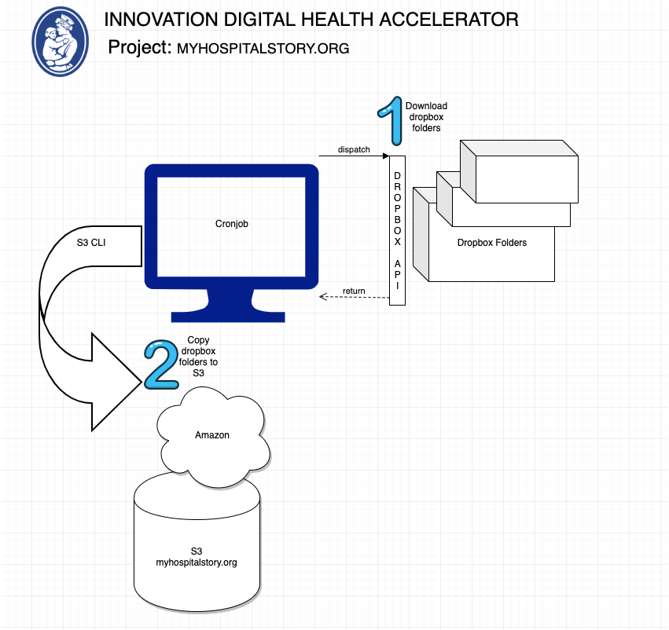

Readme
Repo Url: https://github.com/BCH-IDHA/MYSTORY.git

Project Structure

bashScripts - A shell script to invoke the service to fetch content from designated dropbox folder and 
then upload the same contents to S3. This needs to be a cronJob (schedueler) which can run once a month/day execute
depending on the need.

download-history - This folder is just the history of the dropbox folders that were downloaded. Will not be checked into
the repository

dropbox-to-s3-node - This is the node project. This entails the service call made to dropbox to fetch
the contents.

        ====================================================
		Sequence of Execution:
		====================================================
        1. Copy from Dropbox to local Environment
        2. Copy the contents of the Dropbox folder to S3

        ====================================================
		How to Run:
		====================================================
		* Before running make sure the folder names are consistent and existing in dorbox and S3
        * Setup project "dropbox-to-s3-node" before running bash script
        Open terminal
			> cd /MYSTORY/bashScripts
			> ./dbxToS3.sh
        
        * This will pull the contents from dropbox and push the contents to S3

       

Setup:  Project "dropbox-to-s3-node"
		
		====================================================
		Environment variables:
		====================================================
        Need two variables with values:
            1. DROPBOX_ACCESS_TOKEN
            2. DROPBOX_ROOT_FOLDER_FOR_DOWNLOAD

        DROPBOX_ACCESS_TOKEN: To connect to drop via our nodejs application, we will need to create a dropbox "App" for account we will be using

        - Go to: https://www.dropbox.com/developers/reference/getting-started

        - Login to dropbox account using the "App Console" Button

        - Click Create App

        - Choose Dropbox API folder

        - Choose  Full Dropbox– Access to all files and folders in a user's Dropbox.

        - Add a name for your app (use the folder name that you will be downloading)

        - Click Create App

        - Change "Allow Implicit Grant" to Allow

        - Generate Access Token (this is the access key to dropbox folder. Copy this)

        - Paste the accessKey onto the variable DROPBOX_ACCESS_TOKEN in the .env file (/MYSTORY/dropbox-to-s3-node/.env)

        DROPBOX_ROOT_FOLDER_FOR_DOWNLOAD: Place the path of the drobox folder that is determined to be downloaded

        Change config file accordingly (if required) : /MYSTORY/dropbox-to-s3-node/config/myStoryConfigDB.js
            #This is a temp directory where folders are downloaded
            config.import.dropboxDownloadToLocal_folderName = 'download-history/dropbox'

        ====================================================
		Prerequisites
		====================================================
		Pull repository on to a workspace folder
		Update Node modules by running npm install from the root directory

		====================================================
		How to Run independently of the bash script: (Only for testing)
		====================================================
		Open terminal
			> cd MYSTORY/dropbox-to-s3-node
			> ./services/dropBoxToS3Service.js 

        ====================================================
		RESULT:
		====================================================
        
		The dropbox folder will be dated and downloaded recursively on to the folder :MYSTORY/download-history/

Setup:  Project "bashScripts"

        Open script /MYSTORY/bashScripts/dbxToS3.sh

        Change variables accordingly

        MY_STORY_DROPBOX_SERVICE_DIR

        DROPBOX_DIR_ROOT

        TODAYS_DROPBOX_DIR_FOR_UPLOAD

        S3_BACKUP_DIR_ROOT

        TODAYS_S3_BACKUP_DIR

        S3_BUCKET_NAME

        Save and close

        ====================================================
		How to Run:
		====================================================
        Open terminal
			> cd /MYSTORY/bashScripts
			> ./dbxToS3.sh